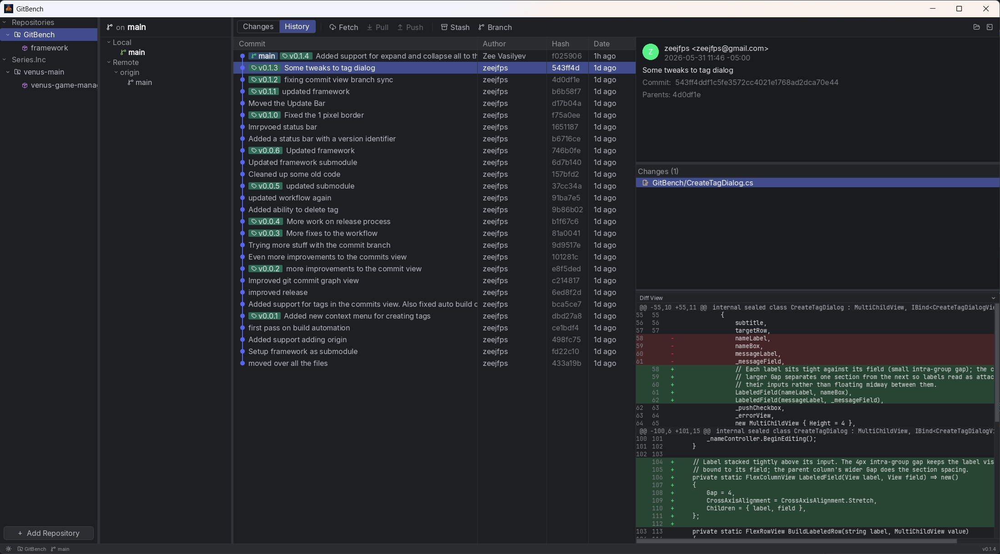

# GitBench

A fast, cross-platform desktop Git client.

[](https://github.com/Zeejfps/GitBench/releases/latest)
[](https://github.com/Zeejfps/GitBench/actions/workflows/release.yml)
[](https://github.com/Zeejfps/GitBench/releases)


GitBench is a lightweight Git GUI built on .NET 10 with a custom GPU-accelerated UI and
compiled to a native executable (Native AOT) — no runtime to install, quick to launch.



## Features

- **Branches** — local and remote branches grouped into folders, with checkout, rename,
  delete, merge, rebase, and fast-forward from the context menu.
- **Local changes** — stage/unstage by file or folder, discard, stash, and an inline diff view.
- **History, stashes, worktrees & submodules** — browse commits and manage the bits a real
  repo actually has.
- **Multiple repositories** — organize repos into collapsible groups in the sidebar.
- **Light & dark themes.**
- **Auto-updates** — the app checks GitHub Releases on launch and offers a one-click restart
  when a new version is available (powered by [Velopack](https://velopack.io)).

## Installation

Grab the build for your platform from the [**latest release**](https://github.com/Zeejfps/GitBench/releases/latest):

- **Windows** — run the `Setup.exe` installer (or use the portable build).
- **macOS** (Apple Silicon) — open the `.pkg` / app bundle.
- **Linux** — run the `.AppImage`.

Once installed, GitBench keeps itself up to date automatically — when an update is ready it
shows a banner, and clicking **Restart** applies it.

> GitBench drives the `git` command line, so make sure **[Git](https://git-scm.com/downloads)**
> is installed and on your `PATH`.

## Building from source

You'll need the [**.NET 10 SDK**](https://dotnet.microsoft.com/download) and **Git**.

```bash
# Clone with submodules (the UI framework lives in a nested submodule)
git clone --recurse-submodules https://github.com/Zeejfps/GitBench.git
cd GitBench

# If you already cloned without --recurse-submodules:
git submodule update --init --recursive

# Build
dotnet build GitBench.sln

# Run
dotnet run --project GitBench/GitBench.csproj
```

> Auto-update only works in an installed build, so a local `dotnet run` simply skips the
> update check.

## Releases

Releases are produced by the [`release` workflow](.github/workflows/release.yml): pushing a
SemVer tag (e.g. `v1.2.3`) builds a Native AOT executable per platform, packages it with
[Velopack](https://velopack.io), and publishes the installers and update feed to GitHub
Releases.

## Contributing

Issues and pull requests are welcome — head to the
[issue tracker](https://github.com/Zeejfps/GitBench/issues) to report a bug or suggest a feature.
