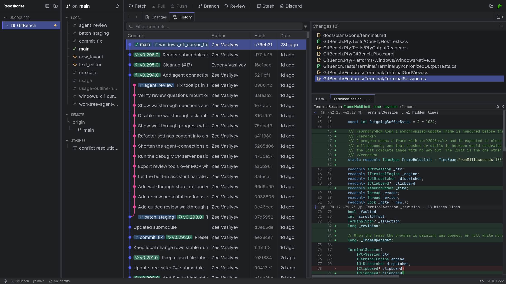

# DiffDino

A fast, cross-platform desktop Git client.

🌐 **Website: [gitbench.builtbyzee.com](https://gitbench.builtbyzee.com)**

[](https://github.com/Zeejfps/GitBench/releases/latest)
[](https://github.com/Zeejfps/GitBench/actions/workflows/release.yml)


[](LICENSE)

DiffDino is a lightweight Git GUI built on .NET 10 with a custom GPU-accelerated UI and
compiled to a native executable (Native AOT) — no runtime to install, quick to launch.



## Features

- **Branches** — local and remote branches grouped into folders, with checkout, rename,
  delete, merge, rebase, and fast-forward from the context menu.
- **Local changes** — stage/unstage by file or folder, discard, stash, and an inline diff view.
- **History, stashes, worktrees & submodules** — browse commits and manage the bits a real
  repo actually has.
- **Multiple repositories** — organize repos into collapsible groups in the sidebar.
- **Light & dark themes.**
- **Auto-updates** — the app checks GitHub Releases on launch and offers a one-click restart
  when a new version is available (powered by [Velopack](https://velopack.io)).

## Installation

Head to [**gitbench.builtbyzee.com**](https://gitbench.builtbyzee.com) or grab the build for your
platform directly from the [**latest release**](https://github.com/Zeejfps/GitBench/releases/latest):

- **Windows** — run the `Setup.exe` installer (or use the portable build).
- **macOS** (Apple Silicon & Intel) — open the `.pkg` / app bundle.
- **Linux** — run the `.AppImage`.

Once installed, DiffDino keeps itself up to date automatically — when an update is ready it
shows a banner, and clicking **Restart** applies it.

> DiffDino drives the `git` command line, so make sure **[Git](https://git-scm.com/downloads)**
> is installed and on your `PATH`.

## Building from source

You'll need the [**.NET 10 SDK**](https://dotnet.microsoft.com/download) and **Git**.

```bash
# Clone with submodules (the UI framework and the tree-sitter bindings are submodules)
git clone --recurse-submodules https://github.com/Zeejfps/GitBench.git
cd GitBench

# If you already cloned without --recurse-submodules:
git submodule update --init --recursive

# One-time: build the native tree-sitter libraries (needs git and a C compiler)
dotnet run scripts/build-native.cs

# Build
dotnet build GitBench.sln

# Run
dotnet run --project GitBench/GitBench.csproj
```

### The native tree-sitter step

`external/cs_tree_sitter` ships C# bindings for tree-sitter but **not** the native
libraries they load — those are built from pinned upstream sources rather than checked
in. `scripts/build-native.cs` wraps `dotnet run external/cs_tree_sitter/native/build.cs`,
which clones tree-sitter and the grammars on its first run and writes
`external/cs_tree_sitter/native/artifacts/<rid>/`. It takes the same arguments —
`--clean`, and `--target <rid>` to cross-build.

Run it once per clone, and again after a `build.cs` pin moves. Until you do,
`dotnet build` fails at `CheckNativeArtifacts` naming the command, and so does
`dotnet test` — the test project references the app. It is not run from MSBuild on
purpose: it needs the network.

`external/cs_tree_sitter` is **ours to edit**, not a vendored third-party drop. A
missing `ts_*` declaration, a wrapper convenience, anything needing `unsafe`, or build
support for a RID we ship belongs there — and changing it means two commits, one in the
submodule and one bumping the pointer here.

> Auto-update only works in an installed build, so a local `dotnet run` simply skips the
> update check.

## Releases

Releases are produced by the [`release` workflow](.github/workflows/release.yml): pushing a
SemVer tag (e.g. `v1.2.3`) builds a Native AOT executable per platform, packages it with
[Velopack](https://velopack.io), and publishes the installers and update feed to GitHub
Releases.

## Contributing

Issues and pull requests are welcome — head to the
[issue tracker](https://github.com/Zeejfps/GitBench/issues) to report a bug or suggest a feature.

## Support

If DiffDino is useful to you, you can support its development:

<a href="https://buymeacoffee.com/zeejfps"></a>

## License

DiffDino's own source is open source under the [MIT License](LICENSE). The bundled UI
framework ([ENV Game Framework](https://github.com/Zeejfps/ENV-Game-Framework)) is a separate
dependency and is not yet covered by this license.
